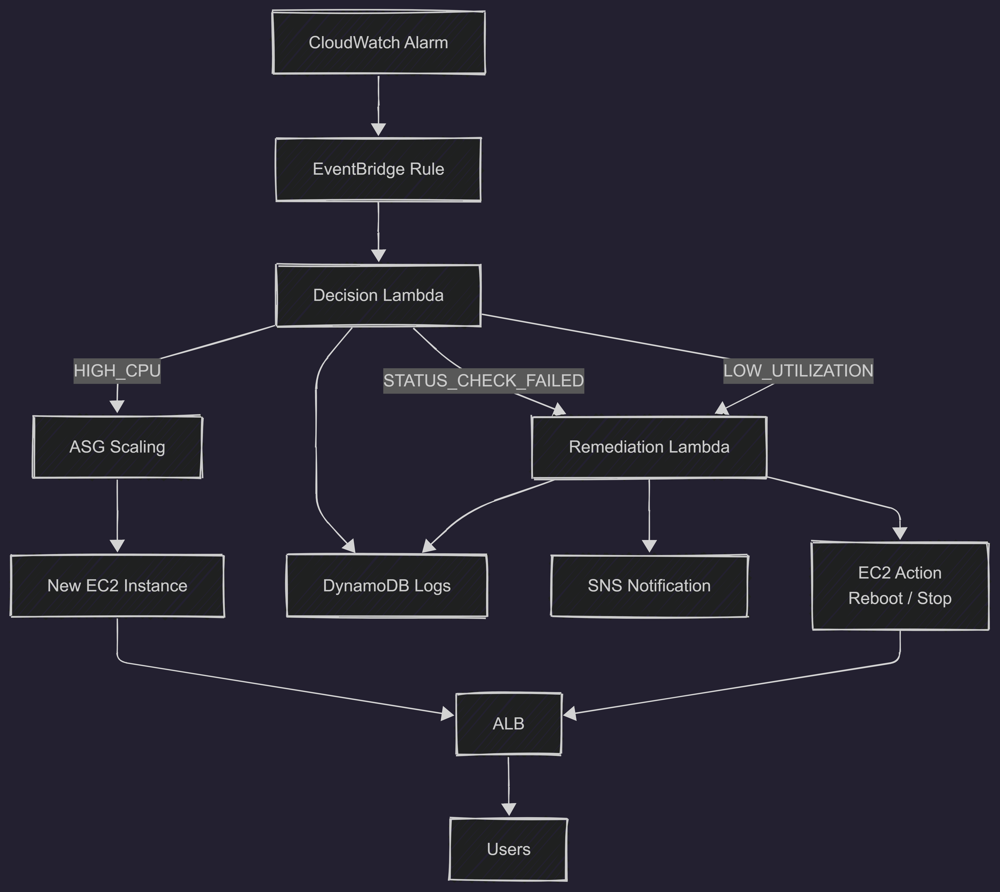
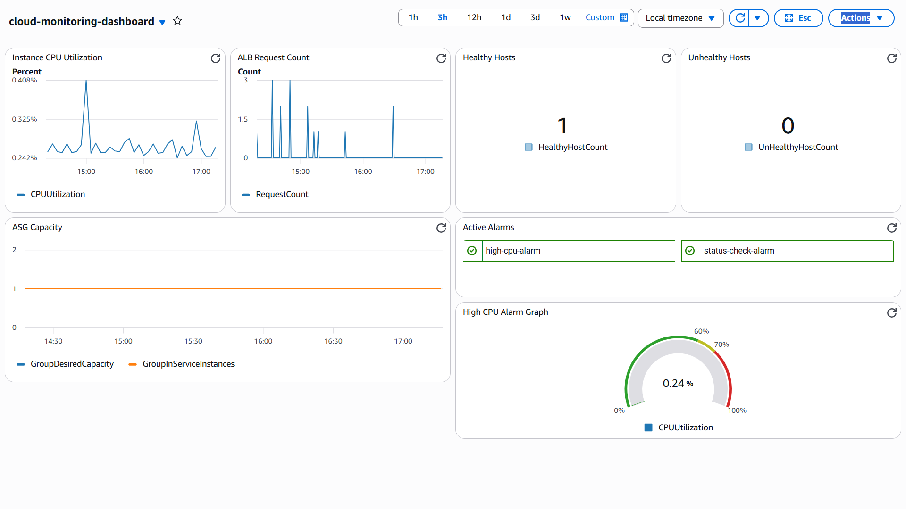
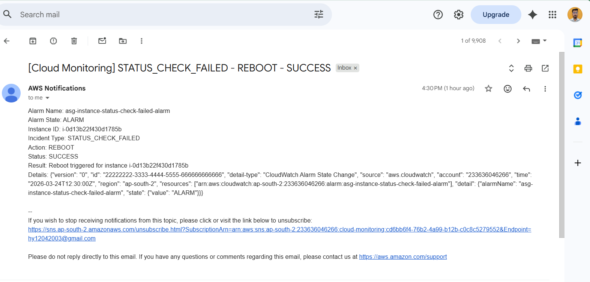
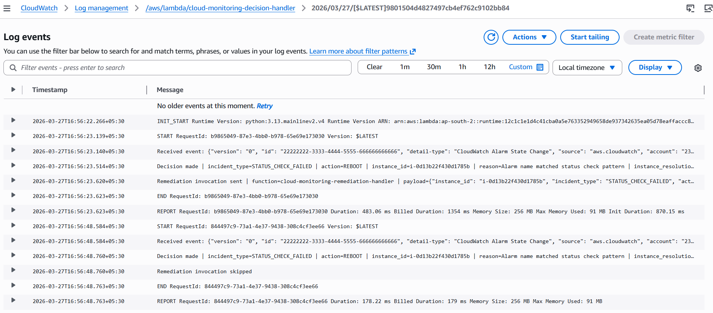

# 🚀 Cloud Monitoring & Auto-Remediation System (AWS)

## 🔥 Overview
A production-grade, event-driven cloud monitoring system built on AWS that automatically detects, classifies, and remediates infrastructure issues in real-time.

This system eliminates manual intervention by integrating monitoring, decision-making, and remediation into a fully automated workflow.

---

## 🌐 Live Demo
👉 http://monitoring-alb-66298104.ap-south-2.elb.amazonaws.com

---

## ⚡ Key Highlights
- Event-driven architecture (CloudWatch → EventBridge → Lambda)
- Automated incident detection & remediation
- Intelligent decision engine with cooldown logic
- Auto Scaling integration (no unnecessary actions)
- DynamoDB-based logging & tracking
- SNS alerts with duplicate suppression
- Fully deployed using Infrastructure as Code (AWS SAM)
- Automated frontend deployment (S3 + EC2 User Data + script)

---

## 🏗️ Architecture


---

## 📊 Monitoring Dashboard


---

## 📧 SNS Alerts


---

## 🧠 Decision Engine Logs


---

## 🧩 Tech Stack
- AWS SAM (CloudFormation)
- AWS Lambda (Python)
- Amazon EC2 + Auto Scaling Group
- Application Load Balancer (ALB)
- CloudWatch (Metrics + Alarms + Dashboard)
- EventBridge
- DynamoDB
- SNS
- Amazon S3 (Frontend storage)

---

## 🔄 System Flow
```
CloudWatch Alarm
   ↓
EventBridge
   ↓
Decision Lambda
   ↓
Remediation Lambda (if required)
   ↓
EC2 Action (Reboot / Stop / Scale handled by ASG)
   ↓
DynamoDB Logs + SNS Notification
```

---

## 🎯 Live Demo Flow
1. Trigger CPU spike or status failure  
2. CloudWatch alarm goes to ALARM  
3. EventBridge triggers Decision Lambda  
4. Incident classified (HIGH_CPU / STATUS_CHECK_FAILED)  
5. Remediation executed (if needed)  
6. SNS alert sent  
7. Logs stored in DynamoDB  

---

## ⚙️ Incident Handling Logic

| Incident Type        | Action                    | Reason |
|---------------------|---------------------------|--------|
| HIGH_CPU            | SCALE_MANAGED_BY_ASG     | ASG handles load |
| STATUS_CHECK_FAILED | REBOOT                   | Instance unhealthy |
| LOW_UTILIZATION     | STOP                     | Cost optimization |

---

## 🧠 Core Design Decisions

### 🔹 Separation of Concerns
- Scaling → ASG  
- Remediation → Lambda  

### 🔹 Cooldown Mechanism
- Prevents alert spam  
- Avoids repeated actions  

### 🔹 Dynamic Instance Targeting
- No hardcoding  
- Automatically resolves instance from ASG  

---

## 🌐 Frontend Deployment

Frontend is deployed using a hybrid approach:

- Stored in S3  
- Pulled by EC2 via User Data  
- Served via Apache + ALB  

### 🔁 Update Flow
```
Update frontend → S3 sync → New instance launch → Auto pull → Live
```

### Command
```
aws s3 sync frontend/ s3://<your-bucket-name>
```

---

## 🚀 Deployment

### Build
```
sam build
```

### First Deploy
```
sam deploy --guided
```

### Subsequent Deploy
```
sam deploy
```

### Full Automation
```
.\deploy.ps1
```

---

## 🧪 Testing

Use test events:
- high_cpu_alarm.json
- status_check_failed_alarm.json

### Expected Behavior
- High CPU → ASG scales  
- Status failure → reboot triggered  
- Duplicate alerts → suppressed  

---

## 🌍 Real-World Impact
- Reduces manual cloud operations  
- Improves system reliability  

---

## 🔮 Future Enhancements
- AI-based decision engine  
- CloudFront + S3 frontend hosting  
- Slack / Webhook alerts  
- Multi-region deployment  
- Predictive scaling  

---

## ⭐ Final Note
This project demonstrates real-world cloud engineering skills including:
- system design
- automation
- cost optimization
- observability
- reliability engineering


## 👨‍💻 Author
Himanshu Yadav


